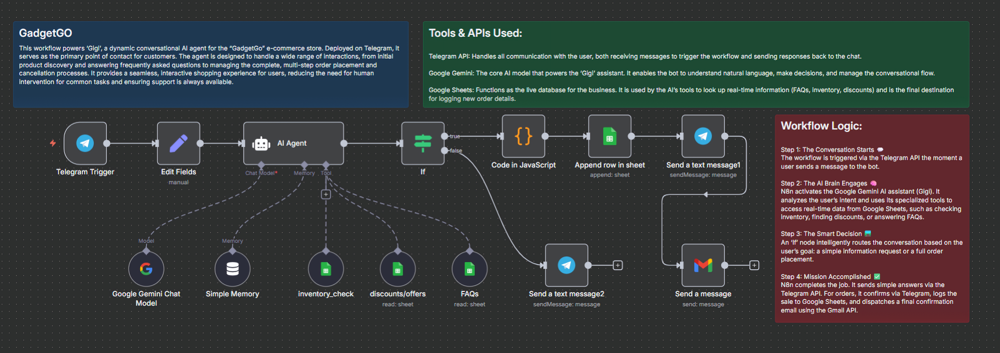

# 🤖 GadgetGo - Conversational E-commerce AI Agent

A comprehensive **e-commerce assistant** built with **n8n** and **Google Gemini**.  
This project showcases a fully automated conversational AI agent capable of managing customer interactions — from **initial queries to final order processing** — all on **Telegram**.

---

## ✨ Project Overview & Purpose
**GadgetGo** is an intelligent chatbot designed for a fictional **tech gadget store**.  
The goal was to build a **robust, automated system** to handle the **entire customer journey**, providing **instant, 24/7 support** for common tasks and freeing up human agents for complex issues.

The agent manages a **multi-step conversation**, providing information, collecting user details, and completing tasks in a **seamless automated flow**.

---

## 🚀 Key Features
- **Conversational Ordering** → Guides users from **product discovery** to **placing orders** within Telegram.  
- **Real-time Inventory Checks** → Connects to **Google Sheets** to provide **instant stock availability**.  
- **Dynamic Knowledge Base** → Pulls FAQs, discounts, and product details directly from Google Sheets.  
- **Multi-Channel Confirmations** → After order placement:  
  - ✅ Sends a **confirmation message** on Telegram  
  - 📊 Logs complete order details to **Google Sheets**  
  - 📧 Dispatches a **professional HTML email** via Gmail API  

---

## 🛠️ Tech Stack & Tools
- **Automation Platform**: [n8n](https://n8n.io/)  
- **AI Model**: Google Gemini  
- **User Interface**: Telegram API  
- **Live Database**: Google Sheets  
- **Email Notifications**: Gmail API  

---

## 📈 Workflow Diagram
Here’s the high-level **n8n workflow** that powers the **GadgetGo AI agent**:

---

## 📌 Learning Outcome
This project was built as a **hands-on application** of concepts learned from the **n8n tutorial**.  
It showcases how to build **practical, multi-step AI automations** for **real-world e-commerce** use cases.

---
